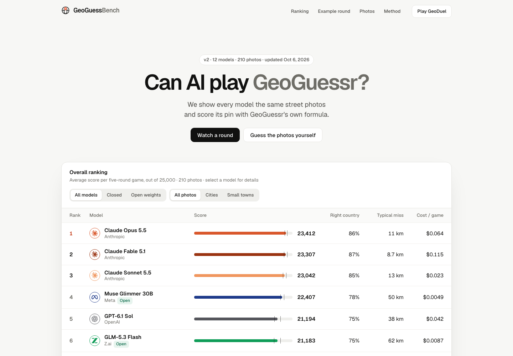

  

<h1 align="center">GeoGuessBench</h1>

An open GeoGuessr benchmark for AI models: the same street photos for every model, scored with GeoGuessr's own curve, published as a one-page site. <a href="https://geoguessbench.vercel.app">geoguessbench.vercel.app</a>

## Tech stack

- Node 24 + TypeScript scripts (tsx), no framework on the pipeline side
- Frozen photo set from Panoramax and KartaView (CC BY-SA 4.0), re-encoded to strip EXIF, gated by a vision check, then reviewed by eye
- Every model reasons at medium effort with the same 32k-token budget: Claude and GPT via their own SDKs, open models via Together AI, all in resumable JSONL runs
- Scoring: 5000 * e^(-km / 1492.7), bootstrap 95% intervals, a paired test for ties, fixed five-photo games
- Tests: `node:test` for scoring, parsing and a data check that the site's numbers recompute from the raw guesses
- Site: Vite + React and Geist, hand-drawn SVG charts on d3-geo (Equal Earth), maker logos from LobeHub icons and simple-icons

## Cloning & running

1. Clone: `git clone <repo> geoguessbench && cd geoguessbench && pnpm install && pnpm -C site install`
2. Keys: `cp .env.example .env.local` and fill in Together, Anthropic and (optionally) OpenAI
3. Photos: `pnpm dataset --tier city --target 100` then `pnpm dataset --tier town --target 150 --per-country 4`
4. Models: `pnpm bench --all` (or `--entries kimi-k3,claude-opus-5-5 --limit 10` for a smoke test)
5. Score and check: `pnpm score` then `pnpm test`; `pnpm og` and `pnpm share` redraw the link preview and the tweet images
6. View: `pnpm site` and open http://localhost:5173

Add a model by appending one entry to `bench/entries.ts`; it plays the same photos as everyone else.

## Roadmap

- [ ] high-effort rows next to the medium ones, to see what extra thinking buys
- [ ] grow to 500 games with Mapillary, which covers rural roads worldwide
- [ ] a human baseline from GeoDuel players on the same photos
- Panning and multi-frame rounds are skipped on purpose: one still keeps every model on identical input.

## License

API keys stay in `.env.local`, which is gitignored; the site is static and calls no API. Code is MIT. Photos belong to their Panoramax and KartaView contributors under CC BY-SA 4.0, credited per photo on the site.
